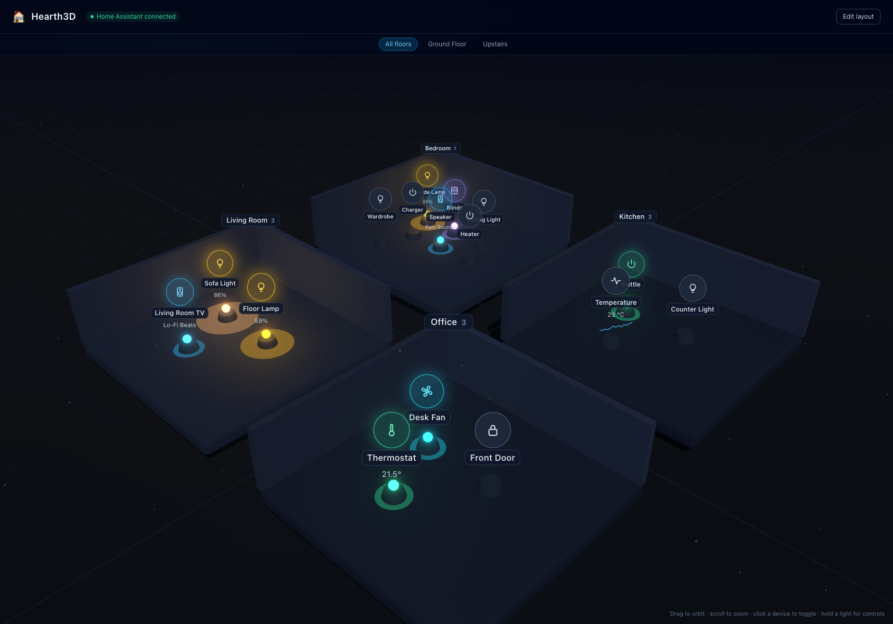
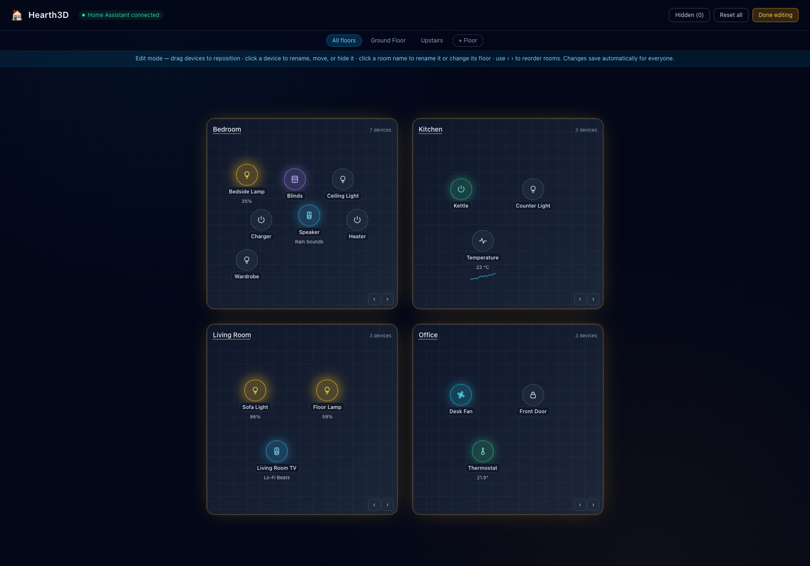

# Hearth3D 🏠

A real-time **isometric dashboard for Home Assistant**, packaged as a single self-contained Docker container.

Hearth3D connects to your local Home Assistant instance, automatically discovers your **floors, areas, devices, and entities**, and renders them as a **live 3D home** (Three.js): orbit and zoom the camera, and watch lit bulbs cast real light into their rooms with bloom. Lights, switches, media players, cameras, sensors and more appear on the room they belong to. States update live, clicking a device controls it, and everything about the view — positions, names, rooms, floors, visibility — is customizable.



```
Browser ◄── WebSocket (port 8080) ──► Node.js backend ◄── HA WebSocket API ──► Home Assistant
   ▲                                        │
   └───────── static React frontend ◄──────┘
```

Everything is generated by one script: **`setup.sh`** writes out the complete project (backend, frontend, Dockerfile, compose file) with no placeholders — run it, add your token, and you're live.

## Features

- 🧊 **Real 3D scene** — Three.js-rendered rooms with walls and shadows; lit bulbs cast actual point lights in their room color, active devices glow with bloom, and the camera orbits/zooms (gentle auto-rotate until you grab it). Graceful fallback message if WebGL is unavailable.
- 🔍 **Zero-configuration mapping** — floors, rooms, and device placement come straight from the Home Assistant floor/area registries. Entity-level area overrides are respected; disabled/hidden entities are skipped. Renaming areas or reassigning devices in HA updates the dashboard live, no restart.
- ⚡ **Real-time** — subscribes to `state_changed` events and streams updates to every open browser instantly.
- 💡 **Click to control** — toggle lights, switches, fans, media players, covers, and locks from the floor plan. Long-press (or right-click) a light for a **brightness slider and color picker**.
- 🏢 **Floors** — HA floors become filter tabs; you can also create your own custom floors.
- 📷 **Camera tiles** — camera entities render live snapshots (refreshed every 10 s), proxied through the backend so your HA token never reaches the browser.
- 📈 **Sensor sparklines** — add `sensor` to `DOMAINS` and numeric sensors show their value with a live mini-chart.
- ✏️ **Full customization in edit mode** — drag devices anywhere on their card; rename, move between rooms, or hide any device; rename rooms, assign them to floors, hide them; reorder rooms; restore anything from the Hidden panel.
- 💾 **Shared, persistent layout** — all customization is stored server-side on a Docker volume, so every browser sees the same dashboard and it survives rebuilds. Overrides are pure overlays: nothing is ever written back to Home Assistant, and clearing a field restores the HA original.
- 🔒 **Token stays server-side** — browsers can only toggle displayed entities and adjust light brightness/color; arbitrary HA service calls are never relayed.
- 🐳 **Single container** — multi-stage Docker build; one image serves the API bridge and the static frontend on one port. Also runs unmodified inside a Home Assistant add-on sandbox (`SUPERVISOR_TOKEN` auto-detected).

### Edit mode



## Requirements

- Docker with the Compose plugin (`docker compose`) — or `docker-compose`
- A running Home Assistant instance reachable from the machine running Docker
- A Home Assistant **Long-Lived Access Token**

## Quick start

**1. Generate the project**

```sh
git clone https://github.com/ShahirShamim/hearth3d.git
cd hearth3d
./setup.sh
cd hearth3d
```

**2. Create a Home Assistant access token**

In Home Assistant: click your profile (bottom-left avatar) → **Security** → **Long-lived access tokens** → **Create token**. Copy it — it is shown only once.

**3. Configure the environment**

```sh
cp .env.example .env
```

Edit `.env`:

```ini
HA_URL=http://192.168.1.50:8123   # your Home Assistant IP address
HA_TOKEN=eyJhbGciOi...            # the token you just created
```

> ⚠️ **Use the IP address of your Home Assistant host, not `homeassistant.local`.**
> mDNS names usually do not resolve inside Docker containers. On Linux you can
> alternatively uncomment `network_mode: host` in `docker-compose.yml`.

**4. Build and run**

```sh
docker compose up --build
```

**5. Open the dashboard**

Visit <http://localhost:8080> — or `http://<docker-host-ip>:8080` from any device on your LAN.

## Using the dashboard

### Everyday control

| Action | How |
|---|---|
| Orbit / zoom the home | Drag / scroll |
| Toggle a device | Click its icon (active devices glow in their domain color) |
| Dim / recolor a light | Long-press or right-click the light |
| Filter by floor | Tabs above the floor plan |
| Check backend status | Header badge shows HA connection; `GET /health` returns JSON |

### Customization (edit mode)

Click **Edit layout** in the header. The view flattens to a top-down plan and everything becomes editable:

| What | How |
|---|---|
| Move a device on its card | Drag it |
| Rename a device / move it to another room / hide it | Click the device |
| Rename a room / change its floor / hide it | Click the room name |
| Reorder rooms | ‹ › buttons on each card |
| Create or delete custom floors | **+ Floor** button / ✕ on a custom floor tab |
| Restore hidden rooms & devices | **Hidden (n)** button in the header |
| Start over | **Reset all** |

Changes save automatically, are shared by every browser, and persist in the `hearth3d-data` Docker volume.

## Configuration

All configuration is via environment variables (set them in `.env`):

| Variable | Default | Description |
|---|---|---|
| `HA_URL` | `http://homeassistant.local:8123` | Base URL of your Home Assistant instance (use its IP) |
| `HA_TOKEN` | *(required)* | Long-lived access token |
| `PORT` | `8080` | Dashboard HTTP/WebSocket port |
| `DOMAINS` | `light,switch,media_player,fan,cover,lock,climate,vacuum,camera` | Entity domains shown on the dashboard |
| `DATA_DIR` | `/data` (in Docker) | Where the shared layout/customization is saved |

Want temperature sensors with sparklines on the floor plan? Add `sensor` to `DOMAINS`.

## What `setup.sh` generates

```
hearth3d/
├── server/                  # Node.js backend: HA bridge + WebSocket + camera proxy + static host
├── frontend/                # React 18 + Vite + Tailwind isometric UI
├── Dockerfile               # multi-stage: build frontend → slim runtime image
├── docker-compose.yml       # port 8080 + persistent hearth3d-data volume
├── .env.example
└── README.md                # project-level docs (same quick start as above)
```

## Local development (without Docker)

```sh
# Terminal 1 — backend
cd hearth3d/server && npm install
HA_URL=http://192.168.1.50:8123 HA_TOKEN=... node server.js

# Terminal 2 — frontend with hot reload (proxies /ws and /api to the backend)
cd hearth3d/frontend && npm install
npm run dev
```

Tip: open the dashboard with `?edit` in the URL to start directly in edit mode.

## Troubleshooting

| Symptom | Cause / fix |
|---|---|
| `auth_invalid` in container logs | Token is wrong or revoked — create a new one |
| `HA connection closed; retrying…` forever | Container can't reach `HA_URL`. Use the IP address, verify port 8123, check firewalls |
| Dashboard is empty | Your entities aren't assigned to areas. In HA: Settings → Devices & services → Devices → assign areas. Also check the **Hidden** panel in edit mode |
| A device is missing | Its domain isn't in `DOMAINS`, the entity is disabled/hidden in HA, or it was hidden in edit mode |
| Camera tile shows an icon instead of an image | The backend couldn't fetch `/api/camera_proxy` from HA — check the container logs |
| `Set HA_TOKEN in a .env file` error on startup | Compose fails fast when the token is missing — create `.env` from `.env.example` |

## Security notes

- The dashboard has **no authentication of its own** — anyone on your LAN who can reach port 8080 can view and control the exposed devices. Do not port-forward it to the internet; put it behind a reverse proxy with authentication for remote access.
- The HA token never leaves the backend (camera snapshots are proxied). Browser clients cannot invoke arbitrary Home Assistant services — only toggles and light brightness/color on displayed entities.

## Roadmap ideas

- Packaging as an installable Home Assistant add-on (the backend already auto-detects the add-on sandbox via `SUPERVISOR_TOKEN`)
- Camera stream (MJPEG) tiles instead of 10 s snapshots
- Sensor history from the HA recorder instead of session-only sparklines
- Scenes and script buttons on room cards

## License

[MIT](LICENSE)
